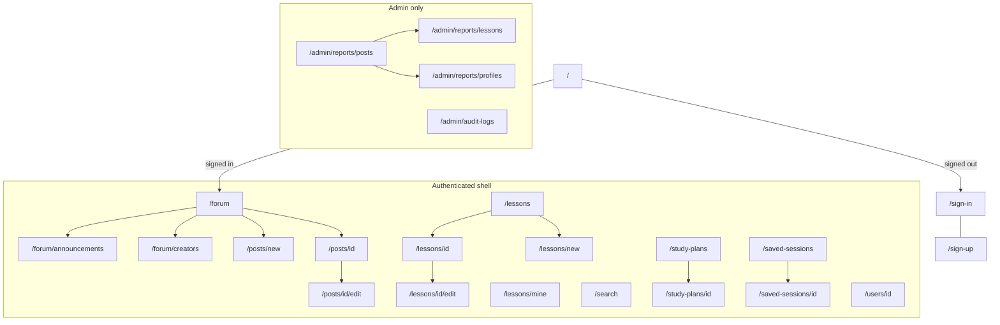

# 6. App Sitemap

This is the information architecture for the Next.js App Router frontend. It is **auth-first**, uses **one shared authenticated shell**, and **role-gated branches**. Routes exist only for in-scope modules and implemented APIs. There is no marketing landing page.

## 1. Design Decisions

- **Auth-first**: `/` redirects signed-in users to `/forum`, everyone else to `/sign-in`. Almost every list endpoint is authenticated; Subjects/Levels are the only public lists.
- **Nested forum routes** (not query-only tabs) so the three product feeds are bookmarkable and match the product's separated sections.
- **Create/edit as pages**, not modals — posts and lessons have file uploads, subject/level/tags, and character limits.
- **No `/admin/users` list** — the API has `GET /users/{id}/` but no user index or user search. Role/ban actions live on the profile page and on profile reports.
- **Share URLs stay short**: `/study-plans/[id]` and `/saved-sessions/[id]` (required shareable public collections). Unauthenticated visitors are sent through Clerk, then back to the same URL.
- **Default landing after sign-in** is `/forum` for every role. Role-specific dashboards are extra destinations (`/lessons/mine`, `/admin`), not separate apps.

## 2. Route Map

## 3. Public / Auth Routes (No App Chrome)

| Route | Who | Purpose |
|---|---|---|
| `/` | All | Redirect: signed-in → `/forum`, else → `/sign-in` |
| `/sign-in/[[...sign-in]]` | Guest | Clerk sign-in |
| `/sign-up/[[...sign-up]]` | Guest | Clerk sign-up; new users become `STUDENT` via JIT provisioning on first API call |

## 4. Shared Authenticated App

| Route | Who | Purpose | Primary APIs |
|---|---|---|---|
| `/forum` | All roles | Main feed (student Question/Sharing) | `GET /posts/?feed=main` |
| `/forum/announcements` | All roles | Admin announcements only | `GET /posts/?feed=announcement` |
| `/forum/creators` | All roles | Followed creators’ posts (all types); empty state if no follows | `GET /posts/?feed=creator` |
| `/posts/new` | All roles (writes blocked if banned) | Create post. Students: type Question/Sharing + mandatory Subject/Level. Creators/Admins: optional Subject/Level; Announcement allowed | `POST /posts/`, `GET /subjects/`, `GET /levels/`, `GET /tags/?search=` |
| `/posts/[id]` | All roles | Post detail, flat comments, vote (not on announcements), save, report, share. Owner/Admin delete. Show 30-day expiry badge | `GET /posts/{id}/`, `GET /comments/?post_id=`, `POST /comments/`, vote/report endpoints |
| `/posts/[id]/edit` | Owner | Edit own post | `GET` + update via existing post APIs |
| `/lessons` | All roles | Lessons board: followed creators first, then others. Filters: subject, level, tags | `GET /lessons/` (published) |
| `/lessons/[id]` | All roles | Lesson detail: rich text, attachments, YouTube embed, vote, save to Study Plan / Saved Session, report. No comments. Admin archive/delete | `GET /lessons/{id}/`, vote/report, collection item POSTs |
| `/search` | All roles | Title-only search with Lesson/Post toggle plus Subject, Level, Tags, Post Type | `GET /posts/?search=` **or** `GET /lessons/?search=` (no unified search endpoint) |
| `/study-plans` | All roles | Own study plans (max 3, lessons only). Disable create if 3 exist or one is empty | `GET/POST /study-plans/` |
| `/study-plans/[id]` | Owner, or any authed user if public | Plan detail + share URL. Public/Private toggle for owner | `GET/PATCH /study-plans/{id}/`, items add/remove |
| `/saved-sessions` | All roles | Own saved sessions (max 3, posts + lessons). Same empty/max rules | `GET/POST /saved-sessions/` |
| `/saved-sessions/[id]` | Owner, or any authed user if public | Session detail + share URL | Same pattern as study plans |
| `/users/[id]` | All roles | Public profile: display name, image, role, follow/unfollow if Creator, public collections, report. Admin: role patch + ban | `GET /users/{id}/`, follow, `POST /reports/`, admin `PATCH .../role/` and `.../ban/` |

`/users/me` is not a page: the nav “Profile” link resolves `GET /users/me/` then routes to `/users/{id}`.

## 5. Creator / Admin Only

| Route | Who | Purpose | Primary APIs |
|---|---|---|---|
| `/lessons/new` | Creator, Admin | Create lesson (Subject + Level mandatory; max 5 files 20MB; YouTube URL field only — no video upload) | `POST /lessons/` |
| `/lessons/[id]/edit` | Owner, Admin | Edit content and state: Draft ↔ Published ↔ Archived | `PUT /lessons/{id}/` |
| `/lessons/mine` | Creator, Admin | Creator dashboard: own lessons by state tabs (Draft / Published / Archived) | `GET /lessons/?state=` |

## 6. Admin Only

| Route | Who | Purpose | Primary APIs |
|---|---|---|---|
| `/admin` | Admin | Redirect to `/admin/reports/posts` | — |
| `/admin/reports/posts` | Admin | Pending post reports; resolve/dismiss; delete post | `GET /reports/?target_type=POST`, `PATCH /reports/{id}/status/` |
| `/admin/reports/lessons` | Admin | Pending lesson reports; archive/delete lesson | `?target_type=LESSON` |
| `/admin/reports/profiles` | Admin | Pending profile reports; ban from here or via profile | `?target_type=USER` |
| `/admin/audit-logs` | Admin | Immutable log of bans and hard deletions | `GET /audit-logs/` |

Report **status** (Pending / Resolved / Dismissed) is a filter on these three pages, not extra routes.

## 7. App Chrome (Nav by Role)

Authenticated layout: global header (search field → `/search?q=`), primary nav, Clerk user menu, and a **read-only banner** when ban state is `BANNED_24H`, `BANNED_7D`, or `PERMANENT_BAN` (hide/disable all write controls; `WARNING` does not lock writes).

| Nav item | Student | Creator | Admin |
|---|---|---|---|
| Forum | yes | yes | yes |
| Lessons | yes | yes | yes |
| My Lessons | no | yes | yes |
| Collections | yes | yes | yes |
| Admin | no | no | yes |
| Profile | yes | yes | yes |

- **Forum subnav** (on `/forum/*` only): Main / Announcements / Creators.
- **Collections subnav** (on study-plan and saved-session routes): Study Plans / Saved Sessions.

## 8. Query Params (Not Extra Routes)

Reuse these on list pages instead of multiplying URLs:

- **Forum**: `?subject=&level=&tags=&post_type=&search=`
- **Lessons board**: `?subject=&level=&tags=&search=`
- **Search**: `?q=&type=post|lesson` plus the same filters; `type` picks which list endpoint to call
- **Reports**: `?status=PENDING|RESOLVED|DISMISSED`

In-context filters on Forum and Lessons stay on those boards. `/search` is the cross-type discovery page.

## 9. Explicitly Not Routes

- Notifications / Noti Board (out of scope)
- Nested comment threads (flat comments live on `/posts/[id]`)
- User directory / user search (no list API)
- Account settings (Clerk UserButton)
- Report confirmation pages (POST from a dialog; `409` if already reported)
- Vote/follow/save as pages (idempotent POST/DELETE from the current view)
- Banned lockout page (banned users still browse; writes are disabled)

## 10. Next.js File Tree

Route groups keep URLs clean:

- `src/app/sign-in/[[...sign-in]]/` and `src/app/sign-up/[[...sign-up]]/` — Clerk, no chrome
- `src/app/(app)/` — authenticated layout + nav
- `src/app/(app)/forum/`, `announcements/`, `creators/`
- `src/app/(app)/posts/new/`, `[id]/`, `[id]/edit/`
- `src/app/(app)/lessons/`, `new/`, `mine/`, `[id]/`, `[id]/edit/`
- `src/app/(app)/search/`
- `src/app/(app)/study-plans/`, `[id]/` and `saved-sessions/`, `[id]/`
- `src/app/(app)/users/[id]/`
- `src/app/(app)/admin/reports/posts|lessons|profiles/` and `admin/audit-logs/`

## 11. Middleware Guards

- Unauthenticated users hitting `(app)` routes go to `/sign-in`.
- Non-admins hitting `/admin/**` go to `/forum`.
- Non-creators/non-admins hitting `/lessons/new`, `/lessons/mine`, `/lessons/[id]/edit` go to `/lessons`.
